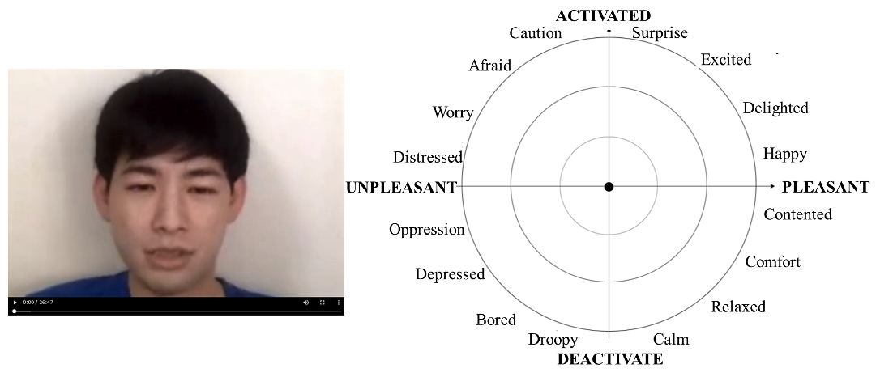

# russell_emotion_annotation

[日本語版](./README_ja.md)

This repository implements a tool for annotating videos with emotion labels using the Russell Circumplex model.



## How to use
1. create a video folder and put the videos you want to annotate.
2. download the Live Server extension to VSCode.
3. display index_video.html on VSCode, right-click on it, and select Open with Live Server.
4. enter a user name (this will be added to the end of the name of the output CSV file).
5. click “Select File” in the upper left corner of the screen and select the video you wish to annotate.
6. When the video is played to the end, the annotation result will be output as a CSV file.

    (Output file name: video_user_name.csv)


## About emotion labels
Emotion labels were created based on Russell's circle model.

Emotion intensity is assumed to be weaker in the center and stronger toward the outside.

Mouse coordinates are acquired every second. The acquired contents are [x,y,time].

## Other functions

Video can be paused and played by left-clicking.

If you make a mistake in labeling and want to correct it, you can pause the video and then return to the seek bar to re-label it.


## Recommended environment

Google Chrome

## Citation

If you find this project useful for your research, please cite our paper:

```
@inproceedings{
  title = {Multimodal Emotion Recognition and Dataset Construction in Online Counseling},
  author = {Toshiki Takanabe and Kotaro Kashihara and Kazuyuki Matsumoto and Keita Kiuchi and Xin Kang and Ryota Nishimura and Manabu Sasayama},
  booktitle = {The 38th Pacific Asia Conference on Language, Information and Computation},
  year = {2024}
}
```

## Acknowledgements

This work was supported by JSPS KAKENHI Grant Numbers JP20K12027, JKA and its promotion funds from KEIRIN RACE, and Japan's National Research and Development Agency New Energy and Industrial Technology Development Organization (NEDO)(JPNP20004).